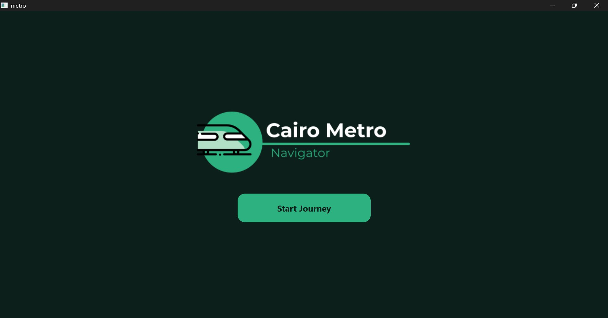
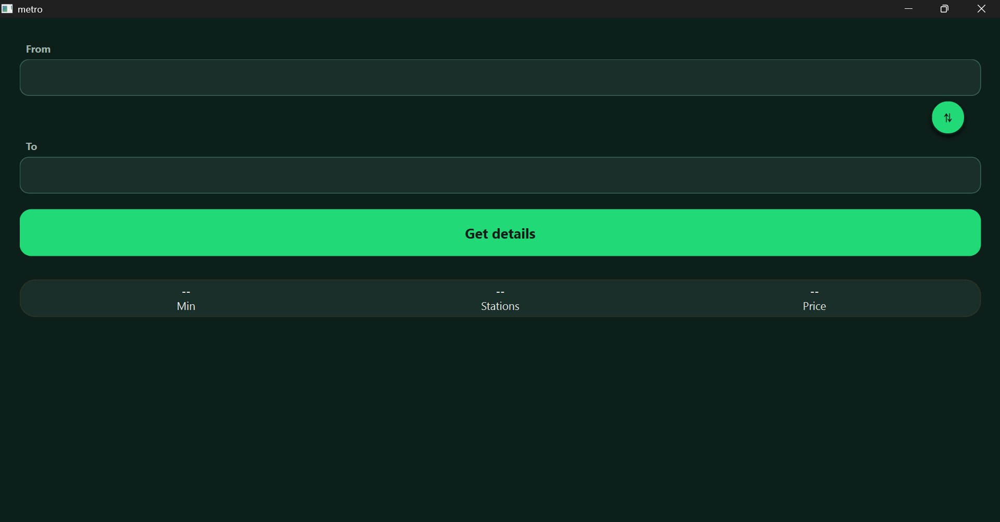
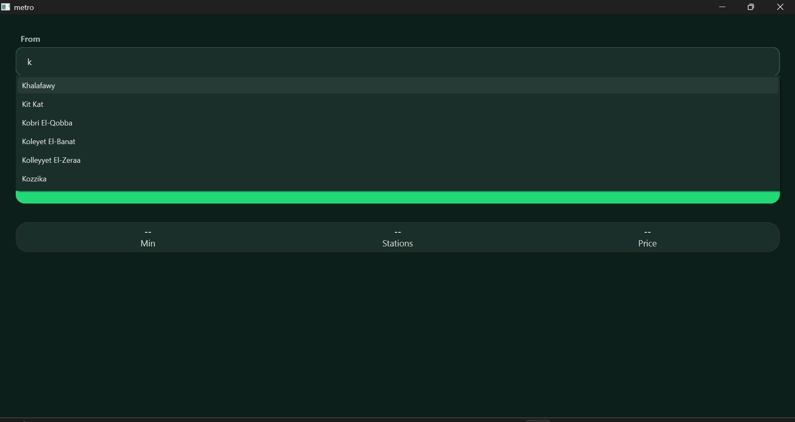
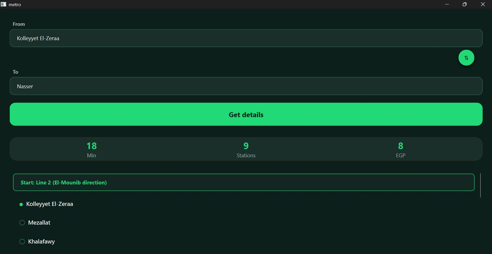
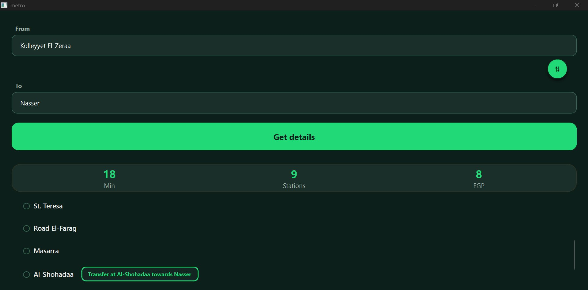
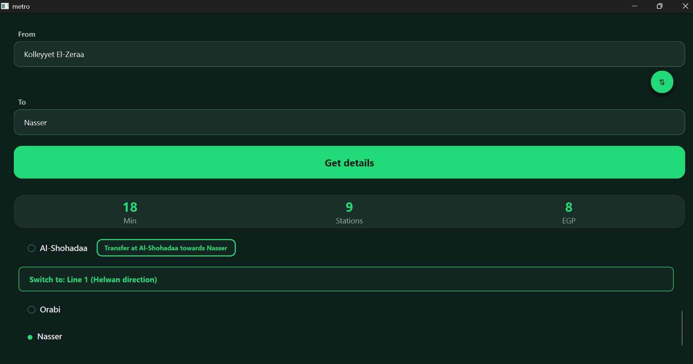

<div align="center">

#  Cairo Metro Navigator

### *A high-performance transit routing engine powered by Generalized Suffix Trees*


-green?style=for-the-badge)

**Developed by Mariam Mohey Ibrahiem Arafa**  
Bachelor of Computer Engineering — Ain Shams University

[ Getting Started](#-getting-started) · [ Screenshots](#-application-screenshots) · [ Architecture](#️-core-architecture) · [ Contributing](#-contributing)

</div>

---

##  Overview

**Cairo Metro Navigator** is a desktop application that reimagines how transit networks are computed. Instead of using the conventional graph-based approach with BFS or Dijkstra's algorithm, this project models the entire Cairo Metro network as a **continuous string sequence** indexed by a **Generalized Suffix Tree**, built using **Ukkonen's Algorithm** in strict linear time $O(N)$.

This is not just a navigation app — it is a proof of concept demonstrating that **string indexing data structures** can outperform traditional graph traversal in certain real-world routing problems, with path retrieval completely decoupled from network density.

---

##  Why This Project Matters

| Traditional Graph Navigation | Cairo Metro Navigator |
|---|---|
| Models stations as vertices, tracks as edges | Models the entire network as a string corpus |
| Path search: $O(V + E)$ — scales with network size | Path retrieval: $O(M)$ — bound only by output length |
| Requires re-traversal on every query | All paths pre-indexed in a single $O(N)$ construction pass |
| Transfer optimization requires additional algorithmic layers | Transfer hub evaluation is native to the routing logic |

> **The core insight:** By treating a transit network as a sequence of integer-encoded station IDs separated by unique terminal tokens, every possible itinerary becomes a suffix already indexed in the tree — making route lookup a direct tree descent rather than a full graph traversal.

---

##  Application Screenshots

### Splash Screen
<div align="center">

</div>

---

### Route Search Interface
<div align="center">

</div>

---

### Smart Autocomplete
<div align="center">

</div>

*Type any letter to instantly filter all matching station names — powered by live prefix search.*

---

### Route Result — Stats + Station List
<div align="center">

</div>

*Every query returns travel time (minutes), station count, and fare (EGP) alongside the full ordered stop list.*

---

### Multi-Line Transfer Detection
<div align="center">

</div>

---

### Complete Transfer Route
<div align="center">

</div>

*When a trip spans two metro lines, the engine automatically identifies the optimal interchange hub and clearly marks the transfer point inline within the route.*

---

##  Core Architecture

### The Suffix Tree Data Engine (`MetroUkkonen`)

The backbone of the application is a **Generalized Suffix Tree** constructed with **Ukkonen's Algorithm**, achieving strict $O(N)$ linear-time indexing of the entire network.

```
All Metro Lines → Encoded as integer sequences → Concatenated with Separator Guards → Indexed into a single Suffix Tree
```

**Key components:**

- **Node Compression** — Each node stores integer pointers (`start`/`end`) into a global text array rather than duplicated data, minimizing memory overhead.
- **Suffix Links** — Internal shortcuts enabling $O(1)$ context shifts during tree construction, maintaining the $O(N)$ bound.
- **Separator Guards (990–999)** — Unique terminal tokens injected between line directions, acting as navigation barriers that prevent cross-line path corruption during recursive backtracking.

| Token | Assignment |
|-------|-----------|
| 999 | Line 1 Forward: Helwan → New El-Marg |
| 998 | Line 1 Backward: New El-Marg → Helwan |
| 997 | Line 2 Forward: El-Mounib → Shubra El-Kheima |
| 996 | Line 2 Backward: Shubra El-Kheima → El-Mounib |
| 995 | Line 3A Forward: Adly Mansour → Rod al-Farag |
| 994 | Line 3A Backward: Rod al-Farag → Adly Mansour |
| 993 | Line 3B Forward: Adly Mansour → Cairo University |
| 992 | Line 3B Backward: Cairo University → Adly Mansour |

### Multi-Line Transfer Optimizer (`MetroSystem::navigate`)

When a trip spans two different lines, the engine evaluates **6 major interchange hubs** — Sadat, Al-Shohadaa, Attaba, Nasser, Cairo University, and Kit Kat — computing both travel legs (`Start → Hub` + `Hub → Destination`) and selecting the hub with the minimum cumulative station count.

**Complexity Summary:**

| Operation | Complexity |
|---|---|
| Tree construction | $O(N)$ — Ukkonen's Algorithm |
| Direct path retrieval | $O(M)$ — length of output route |
| Transfer hub evaluation | $O(6 \times M) = O(M)$ |

---

##  Getting Started

### Prerequisites

| Requirement | Version | Download |
|---|---|---|
| Qt Framework | **6.10.1** | [qt.io/download](https://www.qt.io/download-open-source) |
| CLion IDE | Any recent version | [jetbrains.com/clion](https://www.jetbrains.com/clion/) |

>  **Important:** During Qt installation, make sure to select **MinGW 13.1.0 64-bit** — it is bundled inside the Qt installer, no separate download needed.

---

### Step 1 — Install Qt

1. Download the Qt Online Installer from [qt.io](https://www.qt.io/download-open-source)
2. Run the installer and sign in (free Qt account required)
3. Under **Qt 6.10.1**, check:
   -  `MinGW 13.1.0 64-bit`
4. Under **Developer and Designer Tools**, check:
   -  `MinGW 13.1.0 64-bit`
5. Complete the installation — default path will be `C:\Qt\`

---

### Step 2 — Clone the Repository

```bash
git clone https://github.com/MariamArafa-0/Cairo_Metro_Navigator.git
cd Cairo_Metro_Navigator
```

---

### Step 3 — Configure CLion

1. Open **CLion**
2. Go to **File → Open** and select the `CMakeLists.txt` file inside the cloned folder
3. When prompted, click **"Open as Project"**
4. Go to **File → Settings → Build, Execution, Deployment → CMake**
5. In the **CMake options** field, paste:

```text
-DCMAKE_PREFIX_PATH=C:/Qt/6.10.1/mingw_64
```

6. Click **Apply → OK**
7. Wait for CLion to finish configuring (watch the status bar at the bottom)

---

### Step 4 — Build & Run

```text
Build:  Ctrl + F9
Run:    Shift + F10
```

The application window will launch automatically.

>  The `metro_data.txt` file is automatically copied to the build directory from the `data/` folder by CMake — no manual file placement needed.

---

##  Project Structure

The project follows a clean, production-grade repository structure partitioning source implementations, public header interface files, and operational data assets:

```text
Cairo_Metro_Navigator/
├── .gitignore              
├── CMakeLists.txt         
├── README.md              
├── data/
│   └── metro_data.txt      
├── include/                # Public header definitions (.h interface layer)
│   ├── MainWindow.h
│   ├── MetroSystem.h
│   └── MetroUkkonen.h
├── src/                    # Source implementation codebase (.cpp logic)
│   ├── MainWindow.cpp
│   ├── MetroSystem.cpp
│   ├── MetroUkkonen.cpp
│   ├── main.cpp
│   ├── logo3.png           
│   └── resources.qrc       
└── screenshots/            
    ├── 01_splash.png
    ├── 02_search.png
    ├── 03_autocomplete.png
    ├── 04_result_top.png
    ├── 05_transfer.png
    └── 06_result_bottom.png
```

---

##  Features

*  **Real-time autocomplete** — Instant station filtering as you type
*  **Direct route detection** — Single-line trips resolved in $O(M)$ time
*  **Automatic transfer optimization** — Multi-line trips with mathematically optimal hub selection
*  **Trip statistics** — Travel time, station count, and tiered fare (EGP) tracking per query
*  **Swap button** — Instantly reverse origin and destination selections
*  **Clean dark UI** — Qt Widgets dressed in a custom responsive dark green ecosystem layout

---

##  Contributing

Contributions are welcome! Here's how to get involved:

1. **Fork** the repository on GitHub
2. **Create a branch** for your feature:
```bash
git checkout -b feature/your-feature-name
```

3. **Commit** your changes with a clear message:
```bash
git commit -m "Add: brief description of what you added"
```

4. **Push** to your fork:
```bash
git push origin feature/your-feature-name
```

5. **Open a Pull Request** on GitHub and describe what you changed and why

### Contribution Ideas

* Adding new extension paths or updating coordinates inside `data/metro_data.txt`
* Packaging additional custom stylesheet attributes or str
* uctural layouts
* Designing test vectors validating boundary mechanics of the `MetroUkkonen` engine
* Localizing language interfaces to provide native multi-dialect translations
* Modifying processing rules evaluating transit intersections

> Please ensure your code follows the existing C++20 formatting styles and builds cleanly across native target engines before filing a PR.

---

##  License

This project is licensed under the **MIT License** — see the [LICENSE](LICENSE) file for details.

You are free to use, modify, and distribute this project with proper attribution.

---

##  Authors

**Mariam Mohey Ibrahiem Arafa**  
Bachelor of Computer Engineering — Ain Shams University  
GitHub: [@MariamArafa-0](https://github.com/MariamArafa-0)

**Eithar Diaa Amin Abd Al Aziz**  
Bachelor of Computer Engineering — Ain Shams University  
GitHub: [@eithar25](https://github.com/eithar25)

---
